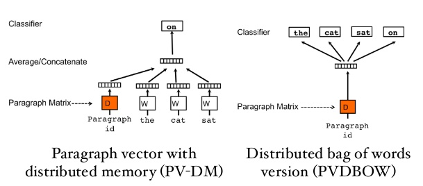

# 용어 정리

> LSA (Latent Semantic Analysis)
```
 입력 데이터에 특이값 분해를 수행해 데이터의 차원수를 줄여, 계산 효율성을 키우는 한편 행간에 숨어 있는 (latent)의미를 이끌어내기 위한 방법론
 행렬(입력 단어, 문장)을 특이값 분해를 수행
 - 효과
 데이터가 클수록 효과가 더 좋음
 새로운 단어가 추가되면 처음부터 작업을 해야 한다.
```
    
---
> Doc2Vec


```
Doc2Vec : 구글 연구 팀이 개발한 문서 임베딩 기법.
          이전 단어 n개가 주어진 경우 다음 단어를 맞추는 언어 모델

Paragraph Vector : 문서 수 X 임베딩 차원 수 크기를 가지는 문서 행렬
학습이 종료되면 문서 수 X 임베딩 차원 수 크기를 가지는 문서 행렬 D를 각 문서의 임베딩으로 사용
아래는 입력 데이터 예시
```
</img>
</img><br/>


---
## 참조 링크
https://www.slideshare.net/keunbongkwak/pr12-distributed-representations-of-sentences-and-documents


